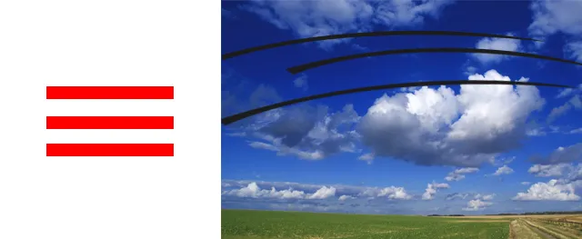

# 天干地支

## 一、干支与岁星纪年的对应

### 十天干

<font color = red> 十天干：甲、乙、丙、丁、戊、己、庚、辛、壬、癸（guǐ）</font>

诗曰：

```
春季甲乙东方木
夏季丙丁南方火
秋季庚辛西方金
冬季壬癸北方水
戊己中央四季土
```

**十天干所具的五行属性:**

```
甲木，纯阳之木，名为大林木，有参天之势，性坚质硬，栋梁之材，故为阳木。
乙木，属纯阴之木、名为花草之木，有装扮人间之美，性柔质软，故为阴木。
```

```
丙火，属纯阳之火，名为太阳大火，有普照万物之功，性情刚烈故为阳火。
丁火，属纯阴之火，名为灯烛之火，有照亮万户之功，性柔质弱，故为阴火。
```

```
戊土，属纯阳之土，名为城墙士，为万物之司命，性高质硬，而向阳，为阳土。
己土，属纯阴之土，名为田园之土，有生育万物之功，培木溶水之能，其性湿质软，低洼向阴，故为阴土。
```

```
庚金，属纯阳之金，名为剑戴之金，有刚健肃杀之力，其性刚质硬，故为阳金。
辛金，为纯阴之金，名为饰金，有增艳人间之美，其性软洁静故为阴金。
```

```
壬水，属纯阳之水，名为江河海洋大水。随地球运转周流不息故为阳水。
癸水，属纯阴之水，名为坑涧水。其性静故为阴水。
```

### 十二地支

<font color=red>十二地支：子、丑、寅、卯、辰、巳、午、未、申、酉、戌、亥</font>


可以用来计时和记月

岁星纪年干支表示：

+ 岁星纪年十干曰：阏逢（yān fé[ng](https://so.csdn.net/so/search?q=ng&spm=1001.2101.3001.7020)）、旃蒙（zhān méng）、柔兆（róu zhào）、强圉（qiáng yǔ）、著雍（zhù yōng）、屠维（tú wéi）、上章（shàng zhāng）、重光（chóng guāng）、玄黓（xuán yì）、昭阳。
+ 岁星纪年十二支曰：困敦（kùn dūn）、赤奋若（chì fèn ruò）、摄提格（shè tí gé）、单阏（chán yān）、执徐（zhí xú）、大荒落（dà huāng luò）、敦牂（dūn zāng）、协洽（xié qià）、涒滩（tūn tān）、作噩（zuò è）、阉茂（yān mào）、大渊献。

### 六十甲子、生肖、时辰

**六十甲子、生肖、时辰：**


## 二、干支纪月

干支纪月口诀：

```
甲己之年丙作首,
乙庚之岁戊为头,
丙辛必定寻庚起,
丁壬壬位顺行流,
更有戊癸何方觅,
甲寅之上好追求.
```

根据口诀及二十字节有：


## 三、干支计时

干支纪时可根据日的干支及口诀：

```
甲己还生甲,
乙庚丙作初,
丙辛从戊起,
丁壬庚子居,
戊癸何方始,
壬子是真途.
```

​    如2022年3月18日14时，年月日直接查万年历：
​    2022年3月18日
​    星期五农历二月十六
​    壬寅年(虎年) 癸卯月 庚午日
​    宜：解除 扫舍 馀事勿取
​    忌：诸事不宜
​    日的天干为庚，根据“乙庚丙作初”可知这一天的子时是丙子时，而14时的地支是未，也就是未时，天干则是癸，即14时是癸未时。所以这一天（2022年3月18日 ）14时出生的人的八字就是：壬寅 癸卯 庚午 癸未。

# 五行


相生:

```
①当木头燃烧的时候就生成了火
②被火烧的物质最后变成灰土
③在土中我门可以提炼到金属
④金属熔化后就成了液体的水
⑤水则是植物生长必不可少的物质
```

相克:

```
①植物 (木)可以破士而生长
②土可以挡住河流(水)
③水则能灭了人
④火能熔化金属
⑤金属刀具可以伐木
```


# 八卦

> 《易传》中说："易有太极，是生两仪，两仪生四象，四象生八卦"

[八卦 - 维基百科 (wikipedia.org)](https://ja.wikipedia.org/wiki/八卦)


最原始的《易经》就是伏羲氏创作的八卦，用八个符号代表天地间的八种自然现象，如下：

**【☰】，象征天，卦名为乾；**

**【☷】，象征地，卦名为坤；**

**【☳】，象征雷，卦名为震；**

**【☲】，象征火，卦名为离；**

**【☵】，象征水，卦名为坎；**

**【☱】，象征泽，卦名为兑；**

**【☴】，象征风，卦名为巽；**

**【☶】，象征山，卦名为艮；**

这八个符号就是卦，合称八卦，每一卦都是由 【— —】、【—】组成。

**【— —】代表“阴”，称作阴爻；**

**【—】代表“阳”，称作阳爻；**

> 孔子在《易传》中说：“是故《易》有太极，是生两仪，两仪生四象，四象生八卦。”

八卦的来源如下：


## 八卦产生

### 太极

> 是故易有太极 

**太极就是宇宙间一切一切共同生存的平台**


### 两仪

> 是生两仪

天地寒来暑往，太阳东升西落，海水潮起潮落……宇宙间万事万物的运行，绝不是靠一股力量，而是有两股看起来相反，实际上相成的力量促成。

把万事万物间相对立相成的两个面称为**阴“— —”、阳“—”，也就是两仪**。


### 四象

> 两仪生四象

阴“— —”、阳“—”生四象。万物有阴阳，我们在阴“— —”、阳“—”符号上各加一层阴“— —”、阳“—”，即为四象。

先加阳爻（—），再加阴爻（— —），因为道生一，一生二，二生三，一是奇数是阳，二是偶数是阴，所以：

**阳（—）上加一阳（—），即为老阳**（⚌）**；**

**阳（—）上加一阴（— —），即为少阳**（⚍）**；**

**阴（— —）上加一阳（—），即为少阴**（⚎）**；**

**阴（— —）上加一阴（— —），即为老阴**（⚏）


### 八卦

> 四象生八卦

万物有阴阳，每一象也有阴阳，我们在四象符号上再各加一层阴“— —”、阳“—”，即为八卦。

**在老阳**（⚌）**上加一阳（—），即为【☰】，我们称之为乾卦**

**在老阳**（⚌）**上加一阴（— —），即为【☱】，称之为兑卦**

**在少阳**（⚍）**上加一阳（—），即为【☲】，称之为离卦**

**在少阳**（⚍）**上加一阴（— —），即为【☳】，称之为震卦**

**在少阴**（⚎）**上加一阳（—），即为【☴】，称之为巽卦**

**在少阴**（⚎）**上加一阴（— —），即为【☵】，称之为坎卦**

**在老阴**（⚏）**上加一阳（—），即为【☶】，称之为艮卦**

**在老阴**（⚏）**上加一阴（— —），即为【☷】，称之为坤卦**

由此可见，八卦是根据四象的阴阳变化生发出来的，八个卦，八种符号。如下图：


## 八卦的象

**乾卦**

乾为天，乾卦为什么取象于天呢？



首先，我们看一下乾卦的卦象【☰】，三条不中断的横线。我们再想一下天的特性有哪些？

**第一个，天是覆盖的，从地的这一头覆盖到那一头，所以我们画天一定会画一条很长的弧线；**

**第二个，天是多层的，它不是薄薄的一层，而是一层又一层的。正所谓天外有天，银河系外还有其它星系。所以我们画天，不会画一条，一定会连续画三条。**

**第三个，天是不中断的，我们不会说，那是你家的天，这是我家的天。**

由此可见，乾卦【☰】的卦象取自于天，就是这样来的。


**巽卦**

巽为风，巽卦的卦象为什么取象于风呢？

我们看一下巽卦的卦象【☴】，即乾卦【☰】的初爻由阳变阴，乾卦三个爻中最下面一爻发生变化，也就是说天下面动，天下面动代表什么？


那时候没有高楼大厦，天下面能动的就是树木。树木摇动，我们通常会说风来了，所以天下面动就是风。

所以，巽卦【☴】的卦象取自于风。


**离卦**

离为火，离卦的卦象象征火，为什么？

我们看一下离卦的卦象【☲】，即乾卦中间的一爻由阳变阴，说明天空中发生了变化，天空当中动，天空当中动是什么呢？


我们观察火，火一烧起来，火光冲天，浓烟滚滚，大家远远看去，就像是天空中着火了一样，而且能感觉到火势在蔓延，躲得远远的。


**兑卦**

兑为泽，兑卦的卦象【☱】，即乾卦最上面的一爻由阳变阴，说明天上面发生变化，天上面动，天上面动又代表什么呢？


伏羲那个时候没有飞机，也没有卫星，什么东西在天上面动？我们到池塘边去看就会发现，天的倒影在水波的地下，水的波浪正好在天的上面。这种情况在狭窄流动的河水上是不容易看到的，爻开阔而平静的湖泽才能清楚地看到天的倒影，所以天上面动，我们称之为泽。

这也是，兑卦【☱】的卦象由来，是比较难以想象的。


**坤卦**

坤为地，坤卦的卦象【☷】，三条断开的横线，为什么取象于地，而不是山呢？


我们看一下大地的特性：

地跟天一样，是广大的，是一层一层的，不是只有薄薄的一层，所以也要画三画。

但是地跟天也有所区别，天是连续的，是没有界线的，但地却是断裂的，是有界线的。就好比国与国之间有国界线，村庄与村庄之间有村界线，分得很清楚，所以三条断开的横线叫地，坤【☷】为地。


**震卦**

我们看震卦的卦象【☳】，即坤卦的初爻由阴变阳，坤卦三个爻中最下面一爻发生变化，也就是说地下面动，地下面动代表什么？


我们看自然界中的雷，雷鸣的时候，像放鞭炮一样，不但直接打到地上来，还打到很深的地下取，整个地仿佛都要裂开了，让人感觉地底下在动。

所以，我们把地底下动叫雷，用符号【☳】表示。


**坎卦**

坎卦的卦象【☵】，坤卦中间的一爻有阴变阳，意即地中间动。地中间动我们很容易想象，大地中间有一条条的水脉，一直绵延不绝、川流不息，那就是水。


所以，我们把地中间动叫坎，用符号【☵】表示。


**艮卦**

艮卦的卦象【☶】，坤卦最上面的一爻由阴变阳，说明地上面发生变化，地上面动，代表什么呢？


我们观察自然，地上面是山，山也会动吗？山当然会动，山动叫走山。山一直都在不停地动，只是动得很缓慢，幅度比较小，

所以，我们把地上面动叫山，用符号【☶】表示。

这就是八卦本象的来源。看了八卦的象，你是不是还有个疑问：八卦的卦名为什么叫“乾、兑、离、震、巽、坎、艮、坤”，不用“天、泽、火、雷、风、水、山、地”呢？

那么，接下来我们就分析一下八卦卦名的来源。

## 八卦的卦名

**乾卦，乾为天**

天这个卦象为什么用乾来命名呢？

> 《易传》乾卦的象辞：“天行健，君子以自强不息。”

天很刚健，永远自强不息地运行，君子应效法天之道：“自强不息”。

由此可见，天最大的特性就是健，天行健，天生万物，运转不息，刚毅坚卓。

我们用乾来形容天的特性。

> 《系辞传》说：“古者包牺氏之王天下也，近取诸身，远取诸物，于是始作八卦，以通神明之德，以类万物之情”


伏羲在卦台山开始画八卦，一画开天，将八卦用来推演世间万事万物，每一卦形都代表一定的事物。

**所以【☰】并不仅仅象征天，而是象征与天的特性同属一类的事物。我们之所以把【☰】叫作乾卦，不叫作天卦，是因为我们把天说成乾，这样就可以用在方方面面，也扩大了天的能量。**


**坤卦，坤为地**

我们总结地的特性：大地母亲非常的柔顺，宽厚宏博，包容万物，最懂得配合，所以我们把它叫作坤，用坤来代表与地一样特性的事物。


**坎卦，坎为水**

《道德经》里说：“水利万物而不争”，但是以碰到水，大家就知道那是很危险的，对人来说是充满坎坷的，它随时会带来很多灾难。

水也可以解释为没有泥土的陆地，所以我们把水称为坎。“坎”这个字分开来看，一个是“欠”，一个是“土”，就是缺少土的意思。人是不能离开土的，一旦“欠土”，人就很危险，所以我们会说坎坷、坎险，用“坎”来形容水的特性，代表与水一样特性的事物。


**震卦，震为雷**

打雷时整个大地都在震动，我们就用震来形容雷，代表和雷一样特性的事物。


**巽卦，巽为风**

风是无孔不入，我们就用巽来形容风，代表和风一样特性的事物。


**兑卦，兑为泽**

看到河泽我们通常会感到心情很愉快，我们就用兑来形容泽的特性，代表和泽一样特性的事物。


**艮卦，艮为山**

艮就是适可而止的意思，就像爬山累了要休息一下，才不会错过路上美丽的风景。我们就用艮来形容山的特性，代表和山一样特性的事物。


**离卦，离为火**

我们就用离来形容火的特性，代表和火一样特性的事物。


所以说，**八卦能代表天地间万事万物。**

**《易传·说卦传》**中也总结了一些：乾、坤、震、巽、坎、离、艮、兑这八个卦所代表的事物，这里每个卦总结5个好识记的卦象分享给大家：

**乾卦：为天、为君、为父、为首、为良马**

**坤卦：为地、为母、为布、为腹、为子母牛**

**震卦：为雷、为龙、为长子、为足、为苍竹**

**巽卦：为木、为风、为长女、为股、为鸡**

**坎卦：为水、为耳、为豕、为弓轮，为心病**

**离卦：为火、为日、为目、为中女、为雉**

**艮卦：为山、为小石、为指、为狗、为鼠**

**兑卦：为泽、为少女、为口、为妾、为羊。**


## 图

先天八卦


后天八卦


六十四卦


# 小六壬

**三不占:**

+ 不诚不占 (心诚则灵，须有敬畏之心)
+ 不义不占(事情正当，而非蝇营狗苟)
+ 不疑不占(不知所措，左右为难才能占卜)

## 掌诀定位

①大安定位——食指根部；
②留连定位——食指指尖；
③速喜定位——中指指尖；
④赤口定位——无名指指尖；
⑤小吉定位——无名指根部；
⑥空亡定位——中指根部

掐算顺序按①大安——②留连——③速喜——④赤口——⑤小吉——⑥空亡，此顺序永远固定不变。

掌诀定位图示:


## 六神释义

①大安

```
健康平安，事情发展顺利，心想事成
特点:正在发生的事会持续发生,未发生的事情难成
大安为青龙木,属春天,位在东方,地支为寅卯，数为一、四、五。
```

②留连

```
流连:流连忘返，事情不顺利，不会有结果，要等的人也不会来，此时不宜轻举妄动
特点:静态，稳定发展，不动的一切
留连为四方土,属四季、位在四角,地支为丑辰 未戍，数为二、七、八、
```

③速喜

```
可能很快会有喜讯传来，会有好结果
特点:快(喜可能不会发生)
速喜为朱雀火,属夏季,位在南方,地支为巳午，数为三、六、九
```

④赤口

```
口舌是非，容易遇到小人，尤其不利于谈事情
特点: 有不吉、惊恐，凶险、口舌是非
赤口为白虎金,属秋季,位在西方,地支为申酉,数为四、一、二
```

⑤小吉　

```
吉祥如意，事情顺利
特点: 佛系、随缘、恰到好处
小吉为玄武水,属冬季,位在北方,地支为亥子，数为五、三、八
```

⑥空亡

```
诸事不顺，会有坏的结果
特点: 空无、没有、空间 、天空
空亡为勾陈土，不在四季，位在中央，天干为戊已，数为六、五、十
```

## 起卦方式

> 需要天地人三宫齐全(起因经过结果)
>
> 同声相应，同气相求

### 月日时


农历6月初九西时

### 时刻分(推荐)

> ①一刻等于14.4分钟(近似15分钟)
>
> ②0按10选(数10下的意思)


17:17  酉时一刻二分

18:45  酉时7刻0分(解释酉时是17:00-19:00，四刻钟为一小时，18:45已经过去一小时了所以要加上四刻钟)

### 时分

时间起卦，现在是10.25，就取10 2 5

### 数字起卦

532 小吉 大安  留连

247 留连 小吉 小吉

### 报数起卦

颜色，声音，车牌号，广告号码可以映射到五行数字比如16水，27火，38木，49金，5.10土

### 小六壬公式

七月二十六巳时 

 7＋26＋6=39
(39－**２**) ÷ **６**＝ 6  余 1

## 三宫

| 天宫 | 地宫   | 人宫 |
| ---- | ------ | ---- |
| 父亲 | 母亲   | 我   |
| 月   | 日     | 时   |
| 起因 | 经过   | 结果 |
| 过去 | 现在   | 未来 |
| 领导 | 主管   | 我   |
| 上庭 | 中庭   | 下庭 |
| 头   | 上身   | 下身 |
| 对象 | 环境   | 自己 |
| 初始 | 物品旁 | 方位 |
| 环境 | 方位   | 吉凶 |
| 朝向 | 坐     | 入气 |
| 外在 | 内在   | 结果 |
| 长辈 | 同辈   | 自己 |
| 年   | 月     | 日   |
| 色彩 | 形象   | 功能 |
| 运势 | 存款   | 结果 |

## 宫职

大安为青龙，为事业宫，主工作、学业，官职。

留连为腾蛇,    为田宅宫,主钱财田宅之事,女人阴私之事，主淫欲。

速喜为朱雀，为感情宫，主婚姻喜事，信息传播,报喜或喜讯,名誉和成就。

赤口为白虎，为疾厄宫，主灾祸，争斗，官司，伤害，凶险之事。

小吉为六合,   为驿马宫,主出行或旅行,为财源，主风流之事。

空亡为勾辰，为福德宫，主阴德、报应，有外财和牢狱之象。

-----------

大安：大安为事业宫，同时也为命宫。

留连：留连为田宅宫，同时也为奴仆宫。

速喜:速喜为感情宫，同时也为夫妻宫，或为婚姻宫。

赤口：赤口为疾厄宫，同时也为兄弟宫。

小吉：小吉为驿马宫，同时也为子女宫。

空亡：空亡为福德宫，同时也是父母宫。

## 天干 TODO

```
大安：天干甲丁
留连：天干丁己
速喜：天干丙辛
赤口:天干庚癸
小吉：天干壬甲
空亡：天干乙戊
```


#  道家小六壬神通（邵一尘）：干支方位图


[邵一尘道家小六壬神通：完整版 (wang1314.com)](https://m.wang1314.com/doc/webapp/topic/21263943.html)

[道家小六壬全集内容（理论基础） | PDF (scribd.com)](https://www.scribd.com/document/644240866/道家小六壬全集内容-理论基础)


