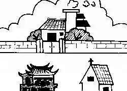
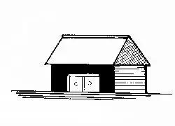

# 阳宅

现今流行的风水门派

+ 峦头派:  长眼法和金锁玉关

+ 理气派：三合、玄空和八宅

## 基础知识

### 风水方位

**界定屋宅朝向**

界定一个宅内，无论这个宅是住宅、工厂、商厦、写字楼、店辅，都是用同一的位理学方法

手拿指南针，注意要站在屋宅门口内或者站在客厅中间位置，**然后红色指针对准大门，若指针指向南边，则表示该房屋朝向为坐南朝北**，同理，若指针指向北边，说明该房子的朝向为坐北朝南，

+ 坐南向北，称为“离宅”
+ 坐西南向东北，称为“坤宅”
+ 坐西向东，称为“兑宅”
+ 坐西北，向东南，称为“乾宅”
+ 坐北向南，称为“坎宅”
+ 坐东北向西南，称为“艮宅”
+ 坐东向西，称为“震宅”
+ 坐东南西北称为“巽宅”

**死夫宅: **1.厕所在房子正中，门中心脏病，中风，气喘；2.西北角是厨房，刀象。命上有灾，同时运上有灾才会呈现。

**无子宅：**1.正东是客厅或餐厅，缺东宫；2.东边的房子里床头压着东边的墙，负负得正。（床头靠北边或西边为吉）。

## 外局形煞

形煞种类繁多，看形煞的总原则：看着像什么就是什
么。
处理方法: 

1. 挡煞:   窗帘、八卦镜、大叶植物、水局等。
2. 化煞：拜佛烧香、美女照镜
3.  斗煞：刀剑、坦克、大炮

这类形煞只是取其形象，依理无据，其本质是习俗。

大煞:

1. 窑烧四绝、庙打八方,依八卦类象断
2. 如医院、学校之类正冲门口或明堂,气场被冲散
3. 动土煞需要考虑流年太岁方,如犯三煞或胎神需避煞

此类大煞,无法挡煞斗煞,只能避免居住。避无可避时,可以取五行生化之法。

**天斩煞**,

化解方法：八卦镜、菜板


**枪煞和反弓煞**

化解方法：镇物镇煞、植物或窗帘挡煞


**穿堂煞**

化解方法：大叶植物稳定气场


**镰刀煞**

住宅有天桥或街道成反弓形，所谓街道反弓，是指楼宇前面的街道弯曲成反弧形，如一把镰刀，而弯角位直冲大门或窗口，其刀口贴着楼房，桥上车辆来来往往，就像拖刀，在风水学称为「镰刀煞」，主家中易遭意外血光，重大疾病，破财及人口伤亡、失火、顽疾等事；反之，楼房若于镰刀之内侧，称之环抱，古人称之「玉带环腰」，升官发财，但不可太近太紧则为索，反而不佳。故此，最好当然是选择有环抱的楼宇了。


**乔升煞**

孤立无援之建筑（指仅有一栋高之大楼，周围比该大楼低的房屋邻接，而被这些矮房子包围的大楼），这栋大楼即受到乔升煞又称（露风煞）冲射，主容易耗财破败，宅主有暗疾。此种比周围高耸的独栋大楼，有极大缺陷，因独自高耸，被风吹得更厉害，住左此大厦的人会有下列三样缺点：

人际关系极孤立，与人难相处，无法能够圆满。妄自尊大，易招小人，家运事业逐渐没落，终告失败。爱慕虚荣，奢侈，无法积蓄，最后负债倒闭。


**飞檐煞**

飞檐煞又称屋角冲射，即邻座楼宇的墙角正对着本座的正门或窗口称为屋角冲射。一般言屋角冲射为大凶，主财气受损，人丁伤亡。角对左边男人不利，角对右边女人大伤，家人经济及精神生活大受破坏。


**穿心煞**

在住宅门口的中央或窗口有电灯柱、电线杆或停车收费表正立着，称之对堂煞，又称为「穿心煞」。凡阳宅犯「穿心煞」。住此宅之人，会破财耗败，易招口舌是非，及有生离死别之患，不利主人。而宅内各人容易患上心腹等病，所以不宜选择这等住宅居住，主大凶。


**凶方有煞**

在住宅的凶方，例如三碧、五黄位，如果再有烟囱、广告招牌、天桥、发射塔、学校、教堂、马路、红绿灯、斑马线，直接冲射过来，主会有车祸，开刀，意外血光，事业不顺利，家宅不和等。


**朱雀煞**

朱雀煞即两家大门正对，主此宅家庭会失和，更会影响财运而衰退。

经曰：二家不可门相对，必主一家退，开门不得两相冲，必有一家凶。

两家相对面，开门时要注意，不可正对相冲，否则，两家中必有一家遭到衰退，或遭凶祸的命运。


**Ｙ形地起屋**

两条路斜斜相交成为Ｙ字形的地方，在交叉点会有产生一块三角形的地形。依风水学，如建筑在这块地上的住宅是容易发生火灾或是多纠纷，使宅运衰退。

经曰：有路行来似铁叉，父南子北不宁家，更言一拙诚堪拙，典卖田园难免他。

门前的路，如果像铁叉那样对冲着门，对这个家很不好，会造成父子不和，家庭不安，典卖祖产的后果。


**马路冲正门**

门前正对一条马路直冲住宅，是为大凶，主败财，及有血光之灾。

经曰：路成丁字害难逃，有口何能下一挑，死别生离真似苦，门前有此非吉兆。

门前（丁）字路对冲着门，灾害一定难免，严重的有生离死别之苦，门前的路成（丁）字形，实在不是好兆头。


**围墙相对**

若两个住宅围墙相向而对，而以地势较低者为不利，主有被压迫欺凌，衰败之象。


**宅屋长短**

住宅房屋应左右高低平均端正，不可左边长而右边短，左边高而右边低，主不损财，不旺丁，此屋不宜居住。若左边短，而右边长，左边低而右边高，主财运亨通，但人丁口可能较为衰微。


**屋前宽后狭**

住宅忌前宽而后狭之形状，主家宅不安宁，虚有其表，居住者常心情不好，苦闷郁抑。


**屋前有大树**

屋前若有大树对冲为不吉，主有血光之灾，居住的人不健康。

正对大门绝不可有大树，因为大树在门前，不但阻扰阳气生机进入屋内，屋内的阴气也不易驱除，从实际生活来说，不但家人出入不便，万一下雨打雷也有招雷殛的危险，而且落业易入屋内，无法保持清洁。


**屋前有枯树**

门前千万不要有枯树，即使不是大树，不管是倒地的或还是直立在地上的，在风水上会影响到家里人的健康和情绪，老人家枉死，医药无效，而且有导引贫贱的力量，最好连根拔除。


**屋前有大石**

住宅前忌有石敢当对门或有大石在屋前，主不利小孩，石敢当或大石偏右，不利女孩，偏左不利男孩。


**屋周围忌种桑**

住屋四周忌种桑树，因为〔桑〕与〔丧〕同音，主有意外之灾，尤其是种在四边角落。


**屋地前高后低**

住宅地基若为前高后低为不吉，主退气，贫穷。


**屋地高于马路**

住屋地基应高于马路，若不如此，下雨时水气会入房屋内，使房屋湿气重，一则影响人之健康，二则影响家俱之使用年限。


**屋在山谷口**

住屋地基应高于马路，若不如此，下雨时水气会入房屋内，使房屋湿气重，一则影响人之健康，二则影响家俱之使用年限。


**屋在山脊上**

宅屋若建在山脊上，主居住人的身体衰弱不健康。


**屋在古井上**

若在古井上建屋，对日后居住的人易得耳目之病，或骗用女人钱，并且常会发生一些奇怪的事物，若建在土质松软的地上，主人贫穷衰微。


**建屋在树根上**

建屋时大量树根埋在地下，因树根是要向上生长的，但被屋压制住，因此屋住的人，很难出头或运气不隹，尤其第一手业主。


**屋前崎岖不平**

屋前若崎呕不平，一则妨碍交通，二则下雨易积水，三则飞尘满天飞，易影响人体之健康，故屋前不宜东一个窟窿，西一个窟窿。


**屋在低洼地**

宅屋忌建于低洼之地，属于低洼之地为凶，因为居于低洼之地，下雨有积水之可能，且给人一种不明朗的感觉。


**屋在死巷尽端**

住宅若建在死巷的尽端为不吉，主居住的人破败耗财，是非不断。


**屋在路中心**

住宅若居于道路正中央为大凶，因为四方来车，凶气会冲克房子，使安全甚虞，故主有血光之灾。


**屋在坟墓边**

住宅附近若有坟墓，不一定不祥，但若再有树林，则更为凶，主居住的人不能平安，烦事一波未平一波起。


**屋边有垃圾站**

住宅四周若是垃圾站，主凶，居住者不健康，因垃圾会破坏地之秀气，且带来蚊蝇，细菌，致使人生病。


**屋前有庙宇**

住宅前忌有庙宇，神坛，教会等建筑物，因为这些都是杀气太重的地方，阴气凝聚之处，倘若住在它的对面，便会首当其冲，如果承受不起，便会有人口伤亡或血光之灾。住得太近寺庙，单是燥音已经难受了，并主家庭生活不安，妇女常遭鬼怪作祟。



**屋前后有山**

住宅若有前山，后山，而左右二边不平坦，主宅运先富后贫，人命官非，败家，不积财，孤单，幽郁。


**屋左有孤墓**

住宅屋附近若有孤墓，为大凶，主居住的人体弱多病，不健康。


**先建围后建屋**

建筑一幢住宅，应由内而外，若先筑围墙之困字、主人不兴发，且有衰落之象。在建筑一幢住宅时，应该先打好房屋的地基，然后完成居室的配置，周围的各房、门。外面的墙围工程留在最后才进行。如果先完成周围与外表的工程，再进行内部的工事，手续上不很顺利，工作效率一定不能高。


**单独矮屋**

所谓独矮屋即周围的房屋皆高矗，唯有本宅为低，称为独矮屋，为不吉，居住的人显得寒酸，落后，不进步，亦有被压迫之感。


**独高屋**

所谓孤高屋即四周围都是较低矮的房屋，唯独本屋一楝突兀其中，是谓孤高屋，孤高屋为不吉，因为曲高和寡，居高不胜寒。


**前门直通后门**

住宅的前门不可直通后门，若如此曰：〔直去水〕水为财，财来财去必成空，任凭你如何的努力亦按留不住，故为不积财之屋。


**屋小门大**

住宅小而门户开得太大，为不吉，因灵气尽泄而不聚财。



**大门再开小门**

住宅大门不可在两边做两个小门进出，否则家中大小自相欺凌，严重者冤屈气层出不穷。


**围墙大小不一**

若宅屋大门之围墙大小不一样，为凶。

经曰：门边土壁要一般，左大换妻更遭官；右边或大胜左边，孤寡儿孙常叫天。

门两旁的墙壁要一样高，不可一边高一边低。如果左边高大，右边低小，对妻子不利，而且有官讼是非。如果右边高大，左边低小，则对夫妇、子孙都不吉利。


**庭园铺石头**

铺小石块在庭园，应配合庭院的宽度，如果在狭窄的庭院里，铺上很多的小石块，在宅相学说，会（招阴而衰微）。在实际上的生活情绪，夏天炎热的季节里，石块会反射及保留相当的热量，在铺满石块的庭院，离地面一公尺高的温度，甚至达到约摄氏五十度左右，石块的容热量大，一直到晚间还不容易得到凉快。反而，冬天，石块却把白天的暧气吸收了，使周围加大寒气。又在雨季的时候，石块会挡住水份的蒸发，使湿气横溢。


**屋有破损**

经曰：门前壁破街砖缺，家中招病长不悦，小口枉死药无医，急要修整莫再迟。

门边的墙壁破了，要赶紧修补，门上的砖瓦缺了，要赶快填加，这不但有关门的美观，而且会影响到家里人的健康和情绪，小儿枉死，医药无效。

**刀煞**

刀煞是一种形煞，其是由住宅附近存在的“刀状”物体所形成的，由于其形成的特点不同，被分为多种不同的种类。如：


普刀煞：一般建筑外墙常见有悬挂商业招牌，这类招牌常常高达一、二层楼那么高，其形状酷似一片刀片，如住宅门窗正对这类物体就是犯了普刀煞。

壁刀煞：自家房子的前面还存在有另一栋房子，而这栋房子又没有和自家的房子对齐，而导致了其某一侧墙壁正对着自家大门，看起来就要像有一把大刀往自家大门劈了过来。化解方法：八卦镜、菜板


大刀煞：很长的直梁柱或横梁柱所形成的直线型态，像一把刀型的直线对到屋宅，也即形成大刀煞。

尖刀煞：自家阳台或主卧室正对附近建筑物的转角或尖角，就像一个楔子，打进住宅中心，风水学叫尖刀煞。化解方法：镇物、植物


斜刀煞：屋宅或办公楼前后，有高架桥或是路桥面横斜近而过。

## 外局气法

> 局气法的基本规则是后天八卦的五行相生关系

外局气法的本质是在诸多楼中选出最好的一栋,并不应具体吉凶事件。

+ 如虎高龙低,主家中妻子掌权。但若一栋楼应了虎高龙低的象,必不可能其中每一家都是妻子掌权。具体到每一家的情况,还要看家中的阴阳是否平衡。

若外局气法合乎易理、流通有情,则居住其中凶者减力、吉者更吉。但其中的吉是因何而吉、凶是因何而凶,吉是何时发吉、凶是何时发凶,则与外局气法无关。

在一个小区当中选择气场最好的楼, 最靠谱的方式: 选中间的 


+ 左青龙、右白虎、前朱雀、后玄武

+ 青龙要高、白虎要低(不能完全没有)、明堂要阔、后靠要稳

  

## 内局气法

内局气法也可以用后天八卦流通相生来判断,但住宅往往面积不大,此种方法用处不大。若是一层楼、公司之类,用八卦流通相生更佳。

**提升宅内气场：**

1. 动植物
2. 春联、字画(自己亲手写最灵)
3. 书籍(最好放在玄关及进门口)
4. 供奉神佛

**内局气场化解方法:**

1. 厕所秽气：白矾、粗盐
2. 厨房燥气：纸灰、锅灰
3. 鞋柜秽气：白矾、藿香
4. 形煞冲射：屏风、大叶植物

## 奇针八法

**一、搪针：**
指针摆动不定，不归中线。断为此地有怪石深潭，居之有祸，若针在巽已丙位泛动，则九尺之
古板古器等，居之出酒色女子，巫师、孤寡贫困之人。
**二、兑针：**
针头上突，又称浮针，说明有阴气介入，但此为善阴，不是自家已故先人，就是福神护法。
**三、沉针：**
针头下沉。说明有阴气介入，此阴非恶阴，但为冤死或非正常死亡者，会使常人感到不适。
**四、转针：**
指针转而不止。恶阴介入，怨恨之气徘徊不停，居住必有伤害。
**五、投针：**
指针半浮半沉，或上浮不达顶，下沉不达底。地下有坟墓，居之必多哭，且需防官司口舌。
**六、逆针：**
针归中线不顺，或针头斜飞。此地出忤逆之人，并人财两败，无风水可言。
**七、侧针**：
钛己静止，但不归中线。此地为神坛古刹，住家不可。
**八、正针：**
无异样且不偏不斜，此地为正常之地，可以考虑其他方面而斟酌用之。

注意: 奇针八法是阴宅寻地之法，于阳宅测量中不可以生搬硬套，要在符合大原则的前提下随机应变
在阳宅堪宅中，罗盘可以作为感气工具使用，**要根据罗盘指针的变化判断宅内不同位置的气场差别**，
再进行针对调整在阳宅勘测中，**奇针八法大体可以用来感气的状况有:**

1. 检测厕所秽气
2. 检测厨房燥气
3. 检测鞋柜秽气
4. 检测内形煞

内局气场化解方法：

1. 厕所秽气：白矾、粗盐
2. 厨房燥气：纸灰、锅灰
3. 鞋柜秽气：白矾、藿香
4. 形煞冲射：屏风、大叶植物

## 宅形辨别

**阴阳：**

+ 一切术数最根本的原理
+ 在阳宅判断中，阴阳平衡大于一切
+ 采光状况会影响情绪
+ 卦位阴阳的强弱决定家庭弟位和家庭帝位
+ 欲催桃花，首先平衡阴阳

**采光过强：**

+ 阳气过高会导致人脾气暴躁易发怒、心中躁动，难以沉下心学习做事。如再遇天斩煞、五黄
  煞、绝命宅之类，易有刀兵之伤。如再遇坤、巽两方同高，易因婆媳矛盾引发家暴。

+ 宜常拉窗帘、贴毛玻璃纸，以降低阳气

**采光过弱：**

+ 阴气过高会导致人心情压抑、身体乏累，诸事不顺。如再遇顶心煞、病符星、祸害宅之类，易患久治不愈的顽疾。如再遇坎方见水或六煞宅，易淫乱、绝嗣。
+ 无解

## 鲁班尺


鲁班尺的主要作用是测量门窗之类气口的尺寸，如门的尺寸符合鲁班尺中的吉位，则能纳到吉祥之气。鲁班尺
分为八个部分，分别是：财、病、离、义、官、劫、害、本。住宅门的宽度取财、本两位为好。

【进户门的尺寸最好是】：迎福、横财、财至、大吉。
【主卧室门的尺寸最好是】：财至、进宝、兴旺、六合。
【儿童房门的尺寸最好是】：登科、贵子、大吉、益利。

注意: 量门(空的那部分)的宽度

## 玄空派

### 三元九运

```
上元
一运1864年-1883年（甲子年至癸未年)
二运1884年-1903年（甲申年至癸卯年)
三运1904年-1923年（甲辰年至癸亥年)
中元
四运1924年-1943年（甲子年至癸未年)
五运1944年-1963年（甲申年至癸卯年)
六运1964年-1983年（甲辰年至癸亥年)
下元
七运1984年-2003年（甲子年至癸未年)
八运2004年-2023年（甲申年至癸卯年)
九运2024年-2043年（甲辰年至癸亥年)
```

注意:  每年会变化, 自行网上查询

#### 玄空九星

**三元九运对应的玄空九星: **

+ 一白星，五行属水，在得令时，代表官升、名气、中状元、官运和财运。失令时，此星为桃花劫，破财损家，甚至性病、绝症，异乡流亡。
+ 二黑星，五行属土，代表病符。此星在得令的时候并非病符，代表位列尊崇，能成霸业。但此星失令的时候，是一极大凶星，破财损家，代表死亡绝
  症、破财横祸，与五黄星并列为最凶之星。此星亦代表招来阴灵。
+ 三碧星，五行属木，代表是非。此星在得令时代表因口材而成名，大利律师、法官等职。但此星失令的时候，代表是非官非，破财招刑。
+ 四绿星，五行属木，在得令的时代表文化艺术、才华、文思敏捷。但失令时为桃花劫星必招酒色之祸。
+ 五黄星，五行属土，得令时代表位处中极、威崇无比，如皇帝之最尊最贵。但此星失令的时，称为五黄煞又名正关煞，代表死亡绝症、血光之灾，家
  破人亡。此星亦必招邪灵之物。
+ 六白星，五行属金，是偏财星，与一白、八白合称三大财星。六白得令时丁财两旺，失令时，为失财星，可令倾家荡产。
+ 七赤星，五行属金，当运的时候，大利以口才工作的人，包括歌星、演说家、占卜家等，大利通讯传播。但七赤星退运时候，代表口舌是非，刀光剑
  影，世界大战。又代表火险、及身体上呼吸、肺部的毛病。
+ 八白星，五行属土，八白星得令时为太白财星，能带来功名富贵。田宅科发，为九星中第一吉星。失令时，为失财失义，瘟疫流行，失财于刹间。
+ 九紫星，五行属火，九紫星当令时为一级喜庆星及爱情星，代表桃花人缘及天乙贵人，大利置业及建筑。但此星失令的时为桃花劫星，损丁破财，亦
  主火灾、爆炸、心脏病、眼疾、流血等。

#### 八卦九宫

**三元九运对应的八卦九宫:**


### 零正催照

口诀:

```
当令为正神，纳气不用水
与正神合十为零神，用水不纳气
催神和照神重要性不高,且在不同门派中取法不同
```

作用:

+ 用来选楼,  在家宅中以神佛或人为中心

解释: 

+ 正神:  该年的运对应的宫
+ 零神: 正神对宫

例子: 

今年2023年,  八运2004年-2023年  —>  八运就是八白星,  五运就是五黄星  —>  8运就是艮,为正神, 需要纳气(窗口), 与正神合十为零神,  及2(坤)为零神，用建水(水),可以用来催财, 要注意坎水绝嗣 。个人建议以人常在的地方为中心定方位。

## 八宅派

### 大游年

口诀

```
上二五鬼下二天
中动绝命对延年
上动生气下祸害
上下俱动六煞方
```

解释:  

+ 对表示全动的意思, 及卦象全动则是延年宅
+ 上二表示上面两爻动的意思, 及卦象上面两爻动则是五鬼宅

### 起伏方式

```
座山起伏位本质是以磁场起伏           《八宅明镜》
门上起伏位本质是以气场起伏  			《阳宅三要》
命卦起伏位本质是以人起伏  			 《阳宅实物透解》
纳甲起伏
```

+ 农村:  座山起伏就是新建的时候用

+ 城市:  门上起伏就是房子房子已经建好了用
+ 重要的地方起伏，一是佛像而是客厅

### 星宫生克&星法断事

x门x主:   ①门(临卦):  起伏位置  ②主(生气):  生气最大的地方, 一般为客厅

河图数:  49火、27金、16水、510土、38木、510中央土

东四宅：坎离震巽；西四宅：艮坤乾兑

震是长子，巽是长女，坎是二子，离是二女，艮是三子，兑是三女

水银(金生水), 豆芽、土豆、洋葱(水生木),  碳(木生火)


#### 生气

生气贪狼木:   本卦在震,利人丁,身体健康,精力旺盛，有活力，有冲劲。

```
乾兑配
坤艮配
坎巽配
离震配
```

生气临乾:   生气木受门宫双克, 长男老父受伤
生气临兑:   生气木被门宫双克, 伤长男少女
生气临坤：坤土受克伤老母
生气临艮：伤子位,求子难

化解:

1. 改乾坤延年或艮兑延年。(通过分房截路改成延年宅或者放佛像)
2. 中和五行之气, 通关法。(推荐)

生气临坎：星宫相生,大吉大利
生气临巽：星宫比合,大吉大利
生气临离：木火通明,八年文昌
生气临震：木火通明,八年文昌

化解：

1. 补充巽方
2. 八年后改主

#### 延年

延年武曲金:  八宅第一吉星,本卦在乾,利财官婚配。随和安逸，有耐性

```
乾坤配
艮兑配
坎离配
震巽配
```

延年临乾:   临本卦宫,大吉大利
延年临坤：阴阳正配,家庭和睦
延年临艮：星宫相生,大吉大利
延年临兑：星宫比合,大吉大利
延年临坎：星来生宫,九年财官(只能管9年)
延年临离：吉星受克,心肺疾病
延年临震：伤长男,巳酉丑年发凶
延年临巽：伤长女,筋骨外伤

化解：

1. 改生气宅
2. 中合五行、通关

#### 天医

天医巨门星:  本卦艮,阳土,催人丁,强健身体,烦恼少

```
乾艮配
坤兑配
坎震配
巽离配
```

天医临乾:   星宫相生,吉,纯阳配,利男不利女
天医临艮:   星宫比合,吉,纯阳配,利男不利女
天医临坤:   比合,吉,纯阴配,利女不利男
天医临兑：相生,吉,纯阴配,利女不利男

化解：

1. 疏土, 放鸡内金，地龙，神曲，麦芽等能梳土的中药, 但是实际是化解不的, 河图数5 10土

天医临坎:   星宫相克,不利女,不利中男
天医临震:   星宫相克,不利女,不利长男
天医临离：利求财,利女不利男
天医临巽：不利长女,不利男

化解：

1. 改主(万能方法，其实就是改最大气场的位置)

#### 绝命

绝命破军金:  本卦兑,官司意外口舌伤灾, 能催财(极其特殊的情况)

```
坤坎配
乾离配
震兑配
巽艮配
```

绝命临乾:   星宫比合,男主人大凶
绝命临离：伤丁发财,心肺疾病(这个特殊，能催财)
绝命临坤：凶星受生,不利老母
绝命临坎:   绝命阴金不生水,伤中男

化解：

1. 改主
2. 消耗卦位之气(放对应相生的东西。临乾(金)就放水(水银), 放的时候，最好半个月被克的人不要待在家里)

绝命临震：长男受克
绝命临兑：男女都有伤
绝命临巽：伤长女
绝命临艮:   先伤子孙,后伤妇女

化解：

1. 改主

#### 五鬼

五鬼廉贞火:  本卦在离,凶星,伤人丁又可催人丁,精神系统疾病,灵异事件,盗贼,官讼。

```
乾震配
坎艮配
巽坤配
离兑配
```

可催孕(不推荐)

五鬼临乾:  震木生五鬼火克乾金,老父受克,心肺疾病
五鬼临震:  震木生五鬼火,长男受克
五鬼临坎:  水火相战,克中男,耳目疾病
五鬼临艮:  星来生宫,短期利财丁,长期衰败
五鬼临巽:  凶星泄巽宫气,大伤长女
五鬼临坤   火炎土燥,伤老母
五鬼临离:  火上加火,伤中女,易火灾
五鬼临兑:  五鬼火克兑金,大伤少女

化解：

1. 锅灰或纸灰, 河图数5  10土
2. 引出五鬼化解。

#### 祸害

祸害禄存土：本卦坤，停滞，闭塞，运气不佳，久治不愈顽疾，胃肠疾病，癌症

```
乾巽配
兑坎配
震坤配
离艮配
```

祸害临乾:   阴土埋金,伤老父,胃肠疾病
祸害临巽：宫克星,伤长女
祸害临兑：少女有伤,慢性疾病
祸害临坎:   伤中男,水受克,主肾病
祸害临震:   星宫相克,伤长男脾胃
祸害临坤：伤老母（多癌症）,女人当家,阴土叠加,不生子
祸害临离：泄离卦气,伤中女,初兴后败
祸害临艮：事业阻塞,发展缓慢

化解：

1. 截路分房
2. 泄卦宫之气

#### 六煞

六煞文曲水:本卦坎,桃花,事业不稳定,肾病,淫乱,可催学业文昌

```
乾坎配
震艮配
巽兑配
坤离配
```

六煞临乾:   水旺,老父作风不正,防扒灰
六煞临坎:   水太旺,男丁飘荡无依
六煞临震:   不利长子,易有作风问题
六煞临艮：不利少男,伤肾
六煞临巽：不利女口,多飘荡之象
六煞临兑:   少女易有作风问题
六煞临坤：有伤老母身体
六煞临离:   星克宫,水火相战,眼耳疾病

化解：

1. 干木(干树根)泄气, 河图数3 8木
2. 截路分房

### 截路分房

####  罗盘要求

**阳宅罗盘要求：**

1. 有八卦和二十四山
2. 指针灵敏

**罗盘使用注意事项：**

1. 不能靠近电子设备

2. 注意水平尺

3. 座山截煞(大凶!)

4. 不是杀师日才能开罗盘

例子

假设门的位置是乾方, 以乾方起伏, **起伏到最大的房间(气场最大)是坤的位置所以这就是延年宅**


 **起伏到厨房(气场次大)的位置是艮的位置所以这就是天一**  像天医+延年这种房子比较好

例子


**截路分房**


### 专向催动

> **神通不及业力**
>
> 需结合:  形法,气法,水法,星法

#### 专向催动：催财

**方式1**

1，不能有形破,如反弓穿堂之类—— 穿堂煞,不与外煞配合还是可以接受的
2，气法合度——采光
3，主要赚钱者卦位不能有破
4，催财以延年为主——做成延年宅
5，零神方见水——玄空

**方式2**

五鬼运财：

1，五鬼火炼绝命金,凶星相制
2，绝命临离——乾方起伏,  最大气场正好是绝命又正好是离卦—>可催财   
3，27数——2,7数是楼层(每个门派不一样)

注意:  一般用在商场,公司,住宅少, 尽快撤掉

#### 专向催动：催官

1，形法不能有破
2，气法合度
3，乾宫及辰戌不能有缺破
4，长期催生气(做成生气宅),短期催五鬼、祸害
5，六白武曲金

注意: 

+ 特别怕动土煞

+ 在办公室或者书房的戌方放: 象征官的东西(如马上封侯)

+ 催生气在东四宅好(东四宅：坎离震巽；西四宅：艮坤乾兑。)

+ 六白武曲金:  看流年飞星(九宫飞星)

#### 专向催动：催桃花

1，阴阳平衡——采光
2，内局气场稳定
3，家中有生旺之气——有绿色植物或者动物
5，属相所在卦位的阴阳正配方无伤破——自己生肖所在的地址-->对象的卦象-->对应的阴阳正配
6，催旺延年——做成延年宅
7，个人桃花位——自己房间

以八字年支或日支查:   亥、卯、未见子;巳、酉、丑见午；寅、午、戌见卯；申、子、辰见酉

注意:  阴阳正配, 八卦中正好对应的

#### 专向催动：催婚姻

1，采光适度
2，总盘卦位阴阳平衡
3，内局气场稳定
4，内外煞重点化解
5，明堂聚气
6，互为延年者无伤破
7，厨房干净整洁

#### 专向催动：催学业

1，巽卦文昌位(整个房子为中心), 不能有伤破,宜生旺之气
2，形法气法符合基本要求即可
3，长期生气、短期六煞(搞6条黑鱼), 放在自己房间
4，流年飞星四绿

#### 专向催动：催子女

1，艮巽及左后方不能伤缺(坎位不要有水)
2，坎及后靠要稳
3,   形法气法符合基本原则
4，长期天医，短期五鬼
5,   胎神方保胎

**胎神所在方位：**

```
月胎神：
正十二月在床房
二三九十门户中
四六十一灶勿犯
五母七磨八厕凶
```

注意:  最怕动土煞

## 择日要点

择日是最难的, 用来确定什么时候动土

1. 《协纪辩方书》 +杨公忌+十二建除
2. 修方
3. 岁破
4. 流年三煞
5. 都天大煞
6. 月破
7. 凶日
8. 房主年命
9. 加强催旺

**下面的情况都不能动土:**

```
1, 修方:戊己日
2，岁破：太岁地支冲地支的月日时及方
3, 流年三煞:流年地支三合的帝旺位所冲地支所在卦位及三煞方
4, 都天大煞：太岁五虎遁到戊己所在地支方
5, 月破:当月地支所冲方位
6，凶日：年月冲、日时冲、月令逢绝
7, 房主年命:年命对冲年月及方
8，加强催旺：根据所要催旺的五行选择日时
```

比如:    今年是丑年  —>   未:  未时未月未日都不能动土

比如:   今年是丑年  –>  三合:    –> 酉卯不能动

…. 难

## 入宅科仪

**入宅流程：**

1. 择日
2. 贡品（依习俗）
3. 表文（诚则灵）


